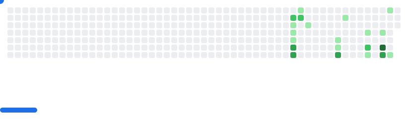

# 本地化 GitHub Actions 说明

本仓库中部分 GitHub Actions 已经本地化，避免依赖外部仓库，提升稳定性。以下列出了各个 Action 的来源和说明。

---

## github-breakout

- **来源**：[cyprieng/github-breakout](https://github.com/cyprieng/github-breakout)
- **版本**：v1.0.0
- **本地路径**：`.github/actions/github-breakout`
- **说明**：用于生成贡献图 Breakout 动画 SVG。已本地化，保留 MIT LICENSE。
- 使用示例：

```html
<div align="center">
  <picture>
    <source media="(prefers-color-scheme: dark)" srcset="results/breakout/breakout-dark.svg" />
    <source media="(prefers-color-scheme: light)" srcset="results/breakout/breakout-light.svg" />
    
  </picture>
</div>
<br>
<div align="center">
  
</div>
```

<div align="center">
  <picture>
    <source media="(prefers-color-scheme: dark)" srcset="results/breakout/breakout-dark.svg" />
    <source media="(prefers-color-scheme: light)" srcset="results/breakout/breakout-light.svg" />
    
  </picture>
</div>
<br>
<div align="center">
  
</div>

---

## ## 

- **来源**：[yoshi389111/github-profile-3d-contrib](https://github.com/yoshi389111/github-profile-3d-contrib)
- **版本**：v0.9.0
- **本地路径**：`.github/actions/github-profile-3d-contrib-0.9.0`
- **说明**：用于生成贡献图 Breakout 动画 SVG。已本地化，保留 MIT LICENSE。
- 使用示例：

```html

```

---

## ## 

- **来源**：[]()
- **版本**：
- **本地路径**：`.github/actions/`
- **说明**：用于生成贡献图 Breakout 动画 SVG。已本地化，保留 MIT LICENSE。
- 使用示例：

```html

```

---

## ## 

- **来源**：[]()
- **版本**：
- **本地路径**：`.github/actions/`
- **说明**：用于生成贡献图 Breakout 动画 SVG。已本地化，保留 MIT LICENSE。
- 使用示例：

```html

```

---

## ## 

- **来源**：[]()
- **版本**：
- **本地路径**：`.github/actions/`
- **说明**：用于生成贡献图 Breakout 动画 SVG。已本地化，保留 MIT LICENSE。
- 使用示例：

```html

```