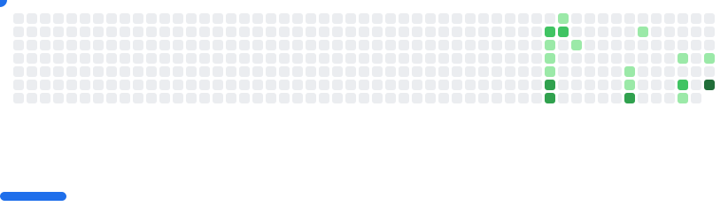

# Hey 👋 Welcome to my GitHub!

  <picture>
    <source media="(prefers-color-scheme: dark)" srcset="results/breakout/breakout-dark.svg" />
    <source media="(prefers-color-scheme: light)" srcset="results/breakout/breakout-light.svg" />
    
  </picture>

 

  

✨ Skills & Interests: Python, Java + Frontend | Coding, Open Source, Security, Games

📖 Check out my blog: [我的博客](http://mpbs.tech/)
